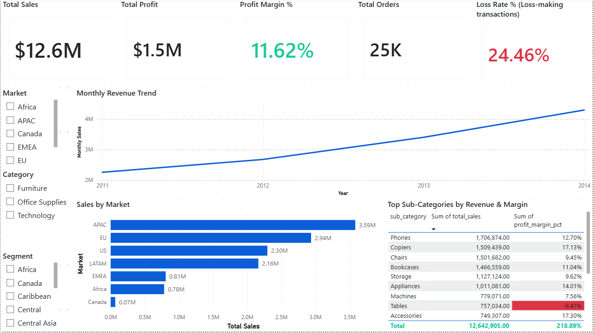
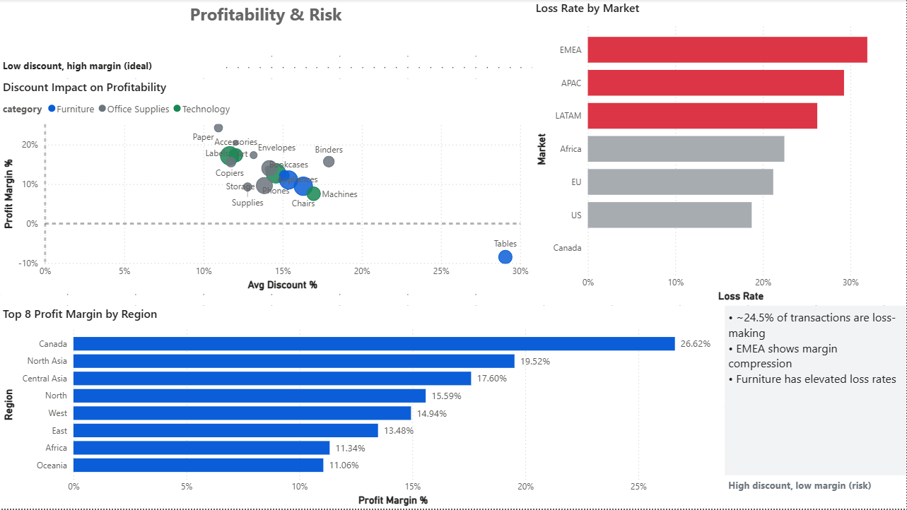
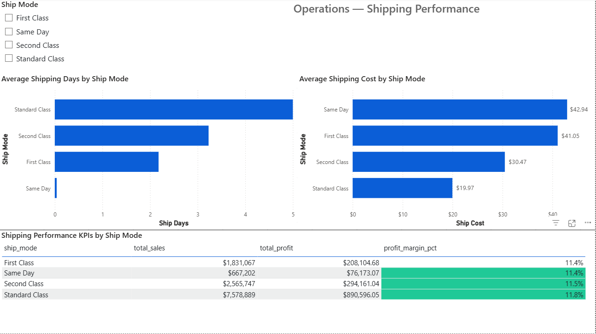
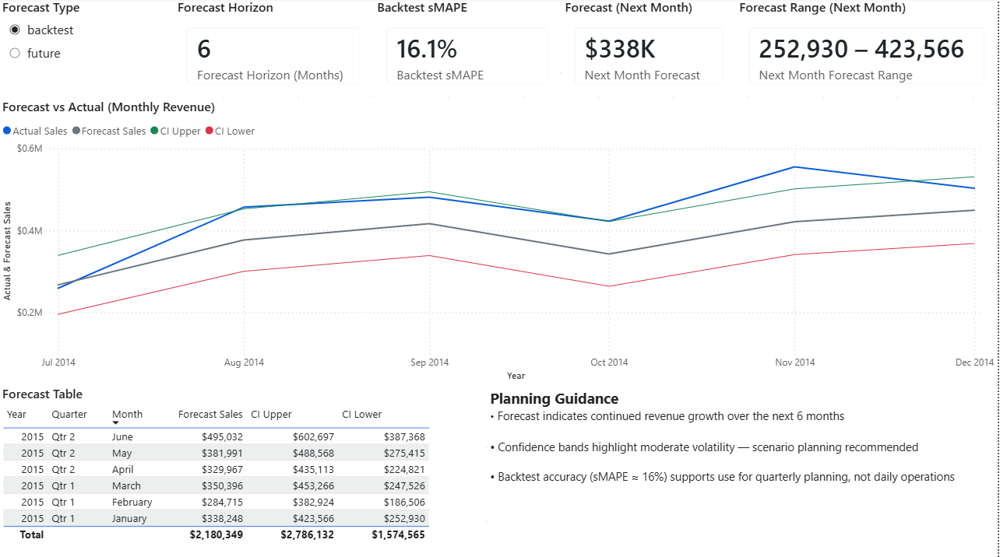

# 📊 Executive Retail BI & Forecasting System

### PostgreSQL • Power BI • Python ETL • Time-Series Forecasting


---

## Overview

An **executive-ready Business Intelligence and Revenue Forecasting system** that transforms raw retail transaction data into:

- **Standardized KPIs** for executive reporting
- **Validated PostgreSQL analytics tables** as a single source of truth
- **Multi-page Power BI dashboards** covering performance, risk, operations, and outlook
- **6-month revenue forecasts** with confidence intervals
- **Actionable business insights and planning recommendations**

This project is built using **production-style analytics engineering practices** — SQL-first metrics, validated ETL pipelines, and reproducible forecasting — not notebook-only analysis.

---

## Business Problem

Retail leadership teams often struggle with:

- fragmented KPI definitions across tools,
- limited visibility into _why_ profit is leaking,
- reactive decision-making without forward-looking signals.

This project operationalizes a **decision-focused analytics workflow** that supports monitoring, diagnosis, and proactive revenue planning.

---

## Objectives

1. Monitor revenue, profit, margin, orders, and loss rate
2. Identify category, market, and regional performance drivers
3. Detect unprofitable sales patterns driven by discounting and shipping cost
4. Forecast monthly revenue for the next **6 months**
5. Translate analytics into **executive-ready recommendations**

---

## Dataset

- **File:** `superstore_sales_clean.csv`
- **Granularity:** one row per **order line item**
- **Records:** 51,290 rows | 25,035 unique orders

### Key Fields

- **Metrics:** `sales`, `profit`, `discount`, `quantity`, `shipping_cost`
- **Dimensions:** `market`, `region`, `category`, `sub_category`, `segment`, `ship_mode`
- **Time:** `order_date`, `ship_date` (+ engineered `shipping_days`)

---

## System Architecture

```text
Raw CSV
  ↓
Python ETL
  - type casting & date parsing
  - validation rules
  - feature engineering (shipping_days)
  ↓
PostgreSQL
  - strongly typed analytics table
  ↓
SQL Views (BI-ready KPI layer)
  ↓
Power BI Dashboards
  ↓
Time-Series Forecasting (SARIMA)
  ↓
Forecast table persisted for BI & planning
```

---

## 🧩 What’s Implemented

**1) Exploratory Data Analysis (EDA)**

- Validated dataset structure, schema, and granularity
- Confirmed date integrity and shipping logic
- Verified no missing values or invalid records
- Quantified core KPIs: sales, profit, margin, and loss rate
- Identified category and geographic performance drivers
- Surfaced early risk signals related to discounting and shipping cost

---

**2) ETL Pipeline → PostgreSQL**

- Environment-based configuration using .env
- Robust CSV extraction and transformation pipeline
- Strong validation rules (types, ranges, date logic)
- Idempotent staging → production load pattern
- Strongly typed analytics table for BI and forecasting
- Sanity checks ensure PostgreSQL metrics match EDA outputs

---

**3) SQL KPI Views (Single Source of Truth)**
All business logic is implemented upstream in SQL, keeping Power BI lightweight, fast, and consistent.

**Implemented views:**

- `public.vw_exec_kpis`
- `public.vw_monthly_sales`
- `public.vw_category_kpis`
- `public.vw_market_kpis`
- `public.vw_region_profitability`
- `public.vw_shipping_kpis`

These views power all dashboards and forecasts.

---

## 📊 Power BI Executive Dashboard

A four-page executive Power BI dashboard built directly on PostgreSQL KPI views.

### Page 1 — Executive Overview

Answers: “How is the business performing overall?”

- KPI cards:
  - Total Sales ($12.6M)
  - Total Profit ($1.5M)
  - Profit Margin (11.62%)
  - Total Orders (25K)
  - Loss Rate (24.46%)
- Monthly revenue trend (2011–2014)
- Sales by market
- Top sub-categories by revenue and margin

**Executive takeaway:**  
Revenue is growing steadily, but a high loss rate indicates margin risk beneath top-line growth.



---

### Page 2 — Profitability & Risk

Answers: “Where are we leaking money?”

- Discount vs Profitability scatter (sub-category level, sized by revenue)
- Loss rate by market with risk highlighting
- Profit margin by region
- Narrative risk summary

**Key signals:**

- ~24.5% of transactions are loss-making
- EMEA shows margin compression
- Furniture has elevated loss rates at higher discount levels



---

### Page 3 — Operations (Shipping Performance)

Answers: “Are shipping decisions hurting margin?”

- Average shipping days by ship mode
- Average shipping cost by ship mode
- Shipping KPI table:
  - Sales
  - Profit
  - Profit Margin (conditional formatting)

**Operational insight:**  
Faster shipping increases cost but does not materially improve margin — standard shipping delivers the best profit efficiency.



---

### Page 4 — Revenue Outlook & Forecast

Answers: “What is the revenue outlook for the next 6 months?”

- Forecast type selector (backtest vs future)
- Forecast horizon (6 months)
- Backtest accuracy (sMAPE ≈ 16.1%)
- Next-month forecast with confidence range
- Actual vs Forecast line chart with confidence bands
- Forecast table for planning
- Executive planning guidance panel



---

- **Operational insight:**
  Faster shipping increases cost but does not materially improve margin — standard shipping delivers the best profit efficiency.

## Page 4 — Revenue Outlook & Forecast

Answers: “What is the revenue outlook for the next 6 months?”

- Forecast type selector (backtest vs future)
- Forecast horizon (6 months)
- Backtest accuracy (sMAPE ≈ 16.1%)
- Next-month forecast with confidence range
- Actual vs Forecast line chart with confidence bands
- Forecast table for planning
- Executive planning guidance panel

---

## 📈 Revenue Forecasting

Monthly revenue is forecasted using a Seasonal ARIMA (SARIMA) model trained on validated PostgreSQL analytics data.

- **Data**
- Source: public.vw_monthly_sales
- Frequency: Monthly (Month Start)
- History: 48 months (2011–2014)

**Modeling Approach**

- Seasonal decomposition confirms trend and annual seasonality
- ADF test indicates non-stationarity → differencing applied
- Model: SARIMA(1,1,1)(0,1,1,12)
- Leakage-free backtesting (last 6 months)
- Baseline comparison: seasonal naive (same month last year)
- Evaluation metric: sMAPE

**Backtest Performance**
| Model | MAE | RMSE | sMAPE |
|------------------|---------|---------|-------|
| Seasonal Naive | 111,973 | 121,002 | 27.67%|
| **SARIMA** | 70,220 | 79,585 | 16.09%|

**Conclusion:**
The SARIMA model significantly outperforms the baseline and is suitable for quarterly and strategic planning, not daily demand forecasting.

---

## Forecast Output

6-month revenue forecast

95% confidence intervals

Forecast vs actual backtest visualization

Persisted to PostgreSQL table:

public.monthly_sales_forecast

---

## 🧠 Business Insights & Recommendations

Key Insights
Revenue exhibits strong seasonality, peaking toward year-end

A small subset of sub-categories generates a disproportionate share of profit

High discount levels strongly correlate with margin erosion

EMEA underperforms on margin despite healthy sales volume

Increased shipping cost does not produce proportional margin gains

---

## Strategic Recommendations

- Increase inventory and staffing ahead of seasonal peaks
- Apply margin-aware discount thresholds instead of blanket discounting
- Double down on high-margin Technology sub-categories
- Re-evaluate pricing and logistics strategy in EMEA
- Favor standard shipping for margin stability unless SLAs justify faster options

---

## 🧰 Tech Stack

- Python: pandas, numpy, SQLAlchemy, statsmodels, scikit-learn
- Database: PostgreSQL
- Analytics Layer: SQL (views & KPI logic)
- BI: Power BI
- Forecasting: SARIMA

---

## 📁 Repository Structure

```
retail-bi-forecasting/
├── dashboards/
│   ├── Executive_Retail_BI_Forecasting.pbix
│   └── screenshots/
├── data/
│   ├── raw/
│   └── processed/
├── notebooks/
│   ├── 01_eda.ipynb
│   └── 02_monthly_revenue_forecasting.ipynb
├── sql/
│   ├── 00_schema.sql
│   ├── 10_bi_views.sql
│   ├── 20_forecast_table.sql
│   └── sanity_checks.sql
├── src/
│   ├── etl_load_postgres.py
│   ├── forecasting/
│   │   └── sarima_forecast.py
│   └── run_forecast.py
├── requirements.txt
└── README.md
```

---

## Business Value Delivered

- Converts raw data into decision-ready executive intelligence
- Enables proactive revenue planning with quantified uncertainty
- Identifies and explains margin leakage drivers
- Demonstrates end-to-end analytics engineering, BI, and forecasting capability
- Transitions analytics from reactive → diagnostic → predictive
